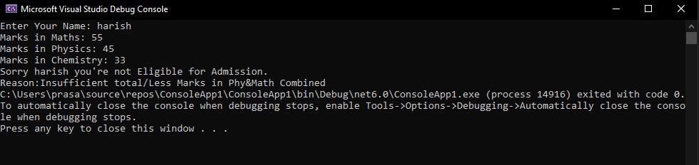

# Eligibility-for-Admission

## Aim:
To write C# program to find the eligibility for admission to an engineering course

## Algorithnm:

### Step 1: Create a new Class named admission.
### Step 2: Create variable of respective data types to store marks & name.
### Step 3: Calculate the total and store it.
### Step 4: The Conditions for admission are:
1.Marks in maths >= 65 & Marks in physics >=55 & Marks in chemistry >=50
2.Total marks in all three subjects >= 180 or total in maths and physics >= 140
### Step 5: Using Nested if check whether the person is eligible or not for admission based on above conditions.
### Step 6: Print the status for admission.
### Step 7: End of the program.

## Program:

### Developed By: Aadheeshwar.A
### Register Number: 212221230001
~~~

using System;
namespace Exp1
{
    public class admission
    {
        public static void Main(string[] args)
        {
            string name;
            int math, phy, chem;
            
            Console.Write("Enter Your Name: ");
            name = Console.ReadLine();
           
            Console.Write("Marks in Maths: ");
            math = Convert.ToInt32(Console.ReadLine());
            
            Console.Write("Marks in Physics: ");
            phy = Convert.ToInt32(Console.ReadLine());
            
            Console.Write("Marks in Chemistry: ");
            chem = Convert.ToInt32(Console.ReadLine());

            int tot = math + phy + chem;
            if (tot >= 180 || math + phy >= 140)
            {
                if (math >= 65 && phy >= 55 && chem >= 50)
                {
                    Console.WriteLine("Congrats "+name+" you're eligible for admission");
                }
                else
                {
                  Console.Write("Sorry "+ name +" you're not Eligible for Admission.\n");
                  Console.Write("Reason:Low Marks in individual subjects");
                }
            }
            else
            {
              Console.Write("Sorry " + name + " you're not Eligible for Admission.\n");
              Console.Write("Reason:Insufficient total/Less Marks in Phy&Math Combined");
            }
        }
    }
}

~~~

## Output:

## Result:
A C# program is written to find the eligibility for admission to an engineering course and has been successfully executed.
